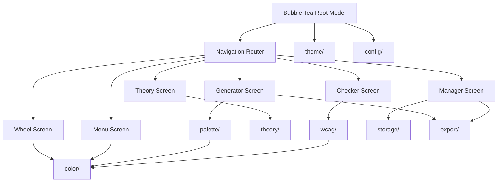

# prism.sh - Technical Design Document

**Version:** 1.0  
**Date:** November 2025  
**For:** Independent Implementation  
**Status:** READY FOR IMPLEMENTATION

---

## Architecture Overview

### ASCII Diagram

```
┌────────────────────────────────────────────┐
│        Bubble Tea Root Model               │
├────────────────────────────────────────────┤
│                                            │
│  ┌──────────────┐  ┌──────────────┐      │
│  │ Wheel Screen │  │ Menu Screen  │ ...  │
│  └──────┬───────┘  └──────┬───────┘      │
│         │                 │              │
│         └─────────┬───────┘              │
│                   │                      │
│            ┌──────▼────────┐             │
│            │ Navigation    │             │
│            │ Router        │             │
│            └──────┬────────┘             │
├───────────────────┼────────────────────┤
│  Core Packages    │                    │
├───────────────────┼────────────────────┤
│                   │                    │
│  ┌───────┐  ┌────▼─────┐  ┌────────┐ │
│  │color/ │  │palette/  │  │wcag/   │ │
│  └───────┘  └──────────┘  └────────┘ │
│                                       │
│  ┌────────┐  ┌────────┐  ┌────────┐ │
│  │storage/│  │export/ │  │theory/ │ │
│  └────────┘  └────────┘  └────────┘ │
│                                       │
│  ┌────────┐  ┌────────┐              │
│  │theme/  │  │config/ │              │
│  └────────┘  └────────┘              │
│                                       │
└────────────────────────────────────────┘
```

### Mermaid Diagram



---

## Tech Stack

### Core

```
Go 1.21+
Bubble Tea (TUI)
Lipgloss (styling)
```

### Supporting Libraries

```
color (github.com/lucasb-eyer/go-colorful)
  - HSL/RGB/HSV conversions
  - Color mathematics

cobra (github.com/spf13/cobra)
  - CLI command structure

viper (github.com/spf13/viper)
  - Configuration management

yaml/json (standard library + gopkg.in/yaml.v2)
  - Export formats
```

### Storage (Cross-Platform)

**Linux:**
```
~/.config/prism/
├── config.toml          (Preferences)
├── palettes/            (Saved palettes)
└── history.json         (Recent colors)
```

**macOS:**
```
~/Library/Application Support/prism/
├── config.toml
├── palettes/
└── history.json
```

**Windows:**
```
%APPDATA%/prism/
├── config.toml
├── palettes/
└── history.json
```

**Implementation:** Use Go's `os.UserConfigDir()` with fallback to home directory + `.config/prism`

---

## Project Structure

```
prism/
├── cmd/
│   └── prism/
│       └── main.go              (Entry point)
├── internal/
│   ├── app/
│   │   ├── model.go             (Root Bubble Tea model)
│   │   ├── nav.go               (Navigation router)
│   │   └── keys.go              (Keybindings)
│   ├── ui/
│   │   ├── styles.go            (Lipgloss styles)
│   │   ├── wheel.go             (Color wheel screen)
│   │   ├── generator.go         (Palette generator)
│   │   ├── theory.go            (Education screen)
│   │   ├── checker.go           (WCAG screen)
│   │   ├── manager.go           (Palette manager)
│   │   ├── components/
│   │   │   ├── palette_display.go
│   │   │   ├── color_swatch.go
│   │   │   └── spinner.go
│   │   └── layout.go            (Common layouts)
│   ├── color/
│   │   ├── types.go             (Color struct)
│   │   ├── convert.go           (Conversions)
│   │   ├── calc.go              (Color math)
│   │   └── parse.go             (Parsing)
│   ├── palette/
│   │   ├── types.go             (Palette struct)
│   │   ├── harmony.go           (7 harmony rules)
│   │   └── generator.go         (Generation)
│   ├── storage/
│   │   ├── config.go            (Config management)
│   │   ├── palettes.go          (Save/load)
│   │   ├── history.go           (Color history)
│   │   └── lock.go              (File locking)
│   ├── export/
│   │   ├── json.go
│   │   ├── css.go
│   │   ├── toml.go
│   │   ├── theme.go             (Kyanite format)
│   │   └── types.go
│   ├── theory/
│   │   ├── lessons.go           (Content)
│   │   ├── glossary.go          (Terms)
│   │   └── examples.go          (Visuals)
│   ├── wcag/
│   │   ├── contrast.go          (Calculation)
│   │   └── validator.go         (Validation)
│   ├── theme/                   (Kyanite app themes for UI styling)
│   │   ├── registry.go
│   │   ├── manager.go
│   │   └── types.go
│   ├── clipboard/               (Cross-platform clipboard)
│   │   ├── clipboard.go
│   │   └── platform_*.go        (OS-specific)
│   └── config/
│       └── types.go
├── tests/
│   ├── color_test.go
│   ├── palette_test.go
│   ├── wcag_test.go
│   ├── export_test.go
│   ├── storage_test.go
│   └── ui_test.go               (TUI component tests)
├── data/
│   ├── colors.json              (CSS + X11 colors, public domain)
│   └── lessons.json             (Theory content)
├── .github/
│   └── workflows/
│       ├── test.yml             (CI: run tests on push)
│       ├── build.yml            (CI: build for multiple platforms)
│       └── release.yml          (CD: create releases with binaries)
├── go.mod
├── go.sum
├── README.md
├── ARCHITECTURE.md
├── CONTRIBUTING.md
├── LICENSE                      (MIT)
├── SECURITY.md
├── CHANGELOG.md
├── ROADMAP.md
└── Makefile
```

---

## Core Data Types

### Color Type

```go
package color

type Color struct {
    Hex string  // Primary: "#FF0080"
    RGB RGB
    HSL HSL
    HSV HSV
    Name string
    Temperature string  // "warm" or "cool"
}

type RGB struct {
    R, G, B float64  // 0-255
}

type HSL struct {
    H float64  // 0-360 degrees
    S float64  // 0-100 percent
    L float64  // 0-100 percent
}

type HSV struct {
    H float64  // 0-360
    S float64  // 0-100
    V float64  // 0-100
}

// Key functions
func (c *Color) Complement() Color
func (c *Color) Lighten(pct float64) Color
func (c *Color) Darken(pct float64) Color
func (c *Color) Saturate(pct float64) Color
```

---

### Palette Type

```go
package palette

type Palette struct {
    ID          string
    Name        string
    Description string
    Colors      []color.Color
    HarmonyRule string         // e.g., "triadic"
    BaseColor   color.Color
    CreatedAt   time.Time
    UpdatedAt   time.Time
    Tags        []string
}

type HarmonyRule string

const (
    Monochromatic      HarmonyRule = "monochromatic"
    Complementary      HarmonyRule = "complementary"
    Analogous          HarmonyRule = "analogous"
    Triadic            HarmonyRule = "triadic"
    Tetradic           HarmonyRule = "tetradic"
    SplitComplementary HarmonyRule = "split_complementary"
    Square             HarmonyRule = "square"
)
```

---

### WCAG Result Type

```go
package wcag

type ContrastResult struct {
    Ratio           float64  // e.g., 5.2
    Level           string   // "AAA", "AA", "FAIL"
    IsLargeText     bool
    PassedAA        bool
    PassedAAA       bool
}

func (c *ContrastResult) Summary() string  // "5.2:1 - WCAG AAA ✓"
```

---

## Module Breakdown

### 1. color/ - Color Math & Conversion

**Key Functions:**

```go
// Parsing
ParseHex(hex string) (Color, error)
ParseRGB(r, g, b int) Color
ParseHSL(h, s, l float64) Color

// Conversion
HexToRGB(hex string) RGB
RGBToHex(r, g, b int) string
RGBToHSL(r, g, b int) HSL
HSLToRGB(h, s, l float64) RGB

// Calculations
GetComplement(h float64) float64
GetAnalogous(h float64) (float64, float64)  // ±30°
GetTriadic(h float64) (float64, float64, float64)  // 120° apart
Lighten(color Color, pct float64) Color
Darken(color Color, pct float64) Color
IsWarm(h float64) bool
IsCool(h float64) bool
```

**Tests Required:**
- Conversions are reversible (Hex → RGB → Hex)
- Math accurate within ±1° or ±1%
- Edge cases (0°, 360°, black, white, gray)

---

### 2. palette/ - Palette Generation

**Key Functions:**

```go
Generate(baseColor Color, rule HarmonyRule) (Palette, error)
GenerateMonochromatic(base Color) Palette
GenerateComplementary(base Color) Palette
GenerateAnalogous(base Color) Palette
GenerateTriadic(base Color) Palette
GenerateTetradic(base Color) Palette
GenerateSplitComplementary(base Color) Palette
GenerateSquare(base Color) Palette
ValidatePaletteContrast(palette Palette) (minContrast float64, ok bool)  // Check 3:1 minimum
```

**Algorithm:**

```
1. Start with base color (convert to HSL)
2. Based on rule, calculate hue positions
3. For each hue, generate variations:
   - 2 tints (L + 15%, + 30%)
   - Base color (original L)
   - 2 shades (L - 15%, - 30%)
4. Select most harmonious 3-7 colors
5. Return Palette
```

**Tests Required:**
- All harmony rules produce correct angles (±5°)
- Generated palettes have minimum 3:1 contrast between adjacent colors
- Monochromatic has 5 distinct lightness values (±15%, ±30%)
- Triadic colors are 120° apart (±5°)
- Tetradic forms proper rectangle (90° intervals)

---

### 3. wcag/ - WCAG 2.1 Contrast

**Key Functions:**

```go
CalculateContrast(foreground, background Color) float64
Validate(fg, bg Color) ContrastResult
ValidateBatch(pairs []ColorPair) []ContrastResult
GetLuminance(color Color) float64

// Thresholds
IsPassingAASmall(contrast float64) bool  // >= 4.5:1
IsPassingAALarge(contrast float64) bool  // >= 3:1
IsPassingAAASmall(contrast float64) bool  // >= 7:1
IsPassingAAALarge(contrast float64) bool  // >= 4.5:1
```

**Complete WCAG 2.1 Formula:**

```go
// Step 1: Convert RGB (0-255) to sRGB (0-1)
func toSRGB(channel int) float64 {
    return float64(channel) / 255.0
}

// Step 2: Apply gamma correction (linearize sRGB)
func linearize(srgb float64) float64 {
    if srgb <= 0.03928 {
        return srgb / 12.92
    }
    return math.Pow((srgb+0.055)/1.055, 2.4)
}

// Step 3: Calculate relative luminance
func RelativeLuminance(r, g, b int) float64 {
    rLinear := linearize(toSRGB(r))
    gLinear := linearize(toSRGB(g))
    bLinear := linearize(toSRGB(b))

    return 0.2126*rLinear + 0.7152*gLinear + 0.0722*bLinear
}

// Step 4: Calculate contrast ratio
func ContrastRatio(l1, l2 float64) float64 {
    lighter := math.Max(l1, l2)
    darker := math.Min(l1, l2)

    return (lighter + 0.05) / (darker + 0.05)
}

// WCAG Thresholds
// AA Small Text: >= 4.5:1
// AA Large Text: >= 3:1
// AAA Small Text: >= 7:1
// AAA Large Text: >= 4.5:1
```

**Tests Required:**
- White (#FFFFFF) on black (#000000) = 21:1 (exact)
- Contrast accurate within ±0.05 compared to WebAIM checker
- AA and AAA thresholds correctly identify pass/fail
- Test cases: #FF0080 on #0D0221 should be ~5.2:1 (AAA pass)
- Edge cases: same color = 1:1, #777777 on #FFFFFF = ~4.48:1 (AA fail)

---

### 4. storage/ - File Persistence

**Key Functions:**

```go
LoadConfig() (Config, error)
SaveConfig(cfg Config) error
SavePalette(p Palette) error            // Atomic write with file locking
LoadPalette(id string) (Palette, error)
ListPalettes() ([]Palette, error)
DeletePalette(id string) error
LockFile(path string) (*FileLock, error)    // Advisory locking
UnlockFile(lock *FileLock) error
AtomicWrite(path string, data []byte) error  // Write to .tmp then rename
```

**Directory Structure (Platform-Aware):**

```
{ConfigDir}/prism/
├── config.toml
├── palettes/
│   ├── {id}.json
│   └── ...
└── history.json

# ConfigDir determined by:
# - Linux: ~/.config
# - macOS: ~/Library/Application Support
# - Windows: %APPDATA%
# - Fallback: ~/.config
```

**File Locking Strategy:**
```go
// Use golang.org/x/sys/unix for Linux/macOS advisory locks
// Use LockFileEx on Windows
// Prevents concurrent writes from multiple prism instances
```

**Tests Required:**
- Save/load preserves all data (byte-for-byte hex match)
- Handles missing files gracefully (returns error, doesn't panic)
- Permissions handled correctly (creates directories as needed)
- Corrupt files don't crash (skip and log error)
- Concurrent writes don't corrupt data (file locking prevents conflicts)
- Atomic writes complete successfully even if interrupted

---

### 5. export/ - Output Formats

**Key Functions:**

```go
ExportJSON(p Palette) ([]byte, error)
ExportCSS(p Palette) string
ExportTOML(p Palette) string
ExportTheme(p Palette) ([]byte, error)
ExportSwatch(p Palette) string  // ASCII
```

**Export Formats (Complete Examples):**

**JSON:**
```json
{
  "id": "palette_20251115_103000",
  "name": "Electric Dream",
  "kyanite_version": "1.0",
  "created_at": "2025-11-15T10:30:00Z",
  "harmony_rule": "triadic",
  "colors": [
    {"hex": "#FF0080", "name": "Electric Pink", "role": "primary"},
    {"hex": "#00D4FF", "name": "Cyan", "role": "secondary"},
    {"hex": "#FFE600", "name": "Yellow", "role": "accent"}
  ]
}
```

**CSS:**
```css
/* Generated by prism.sh - Electric Dream */
/* Created: 2025-11-15T10:30:00Z */
/* Harmony: triadic */

:root {
  /* Hex values */
  --color-primary: #FF0080;
  --color-secondary: #00D4FF;
  --color-accent: #FFE600;

  /* RGB values (for alpha channel) */
  --color-primary-rgb: 255, 0, 128;
  --color-secondary-rgb: 0, 212, 255;
  --color-accent-rgb: 255, 230, 0;
}
```

**TOML:**
```toml
# Generated by prism.sh - Electric Dream
name = "Electric Dream"
harmony_rule = "triadic"
created_at = "2025-11-15T10:30:00Z"

[[colors]]
name = "Electric Pink"
hex = "#FF0080"
role = "primary"

[[colors]]
name = "Cyan"
hex = "#00D4FF"
role = "secondary"

[[colors]]
name = "Yellow"
hex = "#FFE600"
role = "accent"
```

**Kyanite Theme:**
```json
{
  "name": "Electric Dream",
  "kyanite_version": "1.0",
  "created_at": "2025-11-15T10:30:00Z",
  "theme": {
    "primary": "#FF0080",
    "secondary": "#00D4FF",
    "accent": "#FFE600",
    "background": "#0D0221",
    "text": "#F0F3FF",
    "success": "#39FF14"
  }
}
```

---

### 6. theory/ - Educational Content

**Lessons Required:**
1. "Complementary Colors"
2. "Analogous Colors"
3. "Warm vs Cool"
4. "Saturation & Desaturation"
5. "Tints, Shades, Tones"

**Glossary Terms:** 15+ (Hue, Saturation, Value, etc.)

---

### 7. theme/ - Kyanite Theme System

**Copy verbatim from Kyanite standards:**
- 10 themes with exact hex codes
- Theme manager (runtime switching)
- Persistent preference

---

## Implementation Phases

### Phase 1: Foundation (Days 1-2)

- [ ] Project structure
- [ ] Theme system (copy from standards)
- [ ] Color module (types + conversions)
- [ ] Main entry point

**Deliverable:** Project compiles and runs

---

### Phase 2: Features (Days 3-5)

- [ ] Color wheel UI + navigation
- [ ] Palette generator (all 7 rules)
- [ ] Named colors database
- [ ] WCAG checker
- [ ] Storage and loading

**Deliverable:** All features functional

---

### Phase 3: Polish (Days 6-7)

- [ ] Color theory lessons
- [ ] Export formats
- [ ] Help system
- [ ] Testing
- [ ] Documentation

**Deliverable:** v1.0 release ready

---

## Complete Code Skeleton

### main.go

```go
package main

import (
    "fmt"
    "os"
    
    tea "github.com/charmbracelet/bubbletea"
    "github.com/kyanite/prism/internal/app"
)

func main() {
    m := app.NewRootModel()
    p := tea.NewProgram(
        m,
        tea.WithAltScreen(),
        tea.WithMouseCellMotion(),
    )
    
    if _, err := p.Run(); err != nil {
        fmt.Printf("Error: %v\n", err)
        os.Exit(1)
    }
}
```

### internal/app/model.go

```go
package app

import (
    tea "github.com/charmbracelet/bubbletea"
)

type Screen int

const (
    ScreenMenu Screen = iota
    ScreenWheel
    ScreenGenerator
    ScreenTheory
    ScreenChecker
    ScreenManager
)

type RootModel struct {
    CurrentScreen Screen
    Width         int
    Height        int
}

func NewRootModel() RootModel {
    return RootModel{
        CurrentScreen: ScreenMenu,
    }
}

func (m RootModel) Init() tea.Cmd {
    return tea.EnterAltScreen
}

func (m RootModel) Update(msg tea.Msg) (tea.Model, tea.Cmd) {
    switch msg := msg.(type) {
    case tea.KeyMsg:
        switch msg.String() {
        case "ctrl+c", "q":
            return m, tea.Quit
        case "ctrl+h":
            return m, nil // Show help
        }
    }
    return m, nil
}

func (m RootModel) View() string {
    switch m.CurrentScreen {
    case ScreenMenu:
        return m.renderMenu()
    default:
        return "Loading..."
    }
}

func (m RootModel) renderMenu() string {
    return `
╭──────────────────────────────╮
│         PRISM                │
│   Color Design Terminal      │
╰──────────────────────────────╯

[C] Color Wheel
[G] Generate Palette
[L] Learn Theory
[A] Check Accessibility
[M] Manage Palettes
[S] Settings

[Q] Quit | [Ctrl+H] Help
`
}
```

---

## Testing Strategy

### Test Files

```
tests/
├── color_test.go           (Color math and conversions)
├── palette_test.go         (Harmony rules and generation)
├── wcag_test.go            (Contrast calculations)
├── export_test.go          (Export format validation)
├── storage_test.go         (File I/O and locking)
└── ui_test.go              (TUI component tests)
```

### Unit Testing Example

```go
func TestHexToRGB(t *testing.T) {
    tests := []struct {
        hex  string
        want RGB
    }{
        {"#FF0000", RGB{255, 0, 0}},
        {"#00FF00", RGB{0, 255, 0}},
        {"#0000FF", RGB{0, 0, 255}},
        {"#FFFFFF", RGB{255, 255, 255}},
        {"#000000", RGB{0, 0, 0}},
    }

    for _, tt := range tests {
        got, err := HexToRGB(tt.hex)
        if err != nil {
            t.Errorf("unexpected error: %v", err)
        }
        if got != tt.want {
            t.Errorf("HexToRGB(%q) = %v, want %v", tt.hex, got, tt.want)
        }
    }
}
```

### TUI Testing Strategy

**Testing Bubble Tea Components:**

```go
// Test model state transitions
func TestColorWheelNavigation(t *testing.T) {
    m := NewColorWheelModel()

    // Simulate right arrow key
    msg := tea.KeyMsg{Type: tea.KeyRight}
    newModel, _ := m.Update(msg)

    wheelModel := newModel.(ColorWheelModel)
    if wheelModel.CurrentHue != 1 {
        t.Errorf("Expected hue 1, got %d", wheelModel.CurrentHue)
    }
}

// Test view rendering (basic string checks)
func TestMenuView(t *testing.T) {
    m := NewMenuModel()
    view := m.View()

    if !strings.Contains(view, "Color Wheel") {
        t.Error("Menu should contain 'Color Wheel' option")
    }
    if !strings.Contains(view, "Generate Palette") {
        t.Error("Menu should contain 'Generate Palette' option")
    }
}

// Test message handling
func TestPaletteGeneration(t *testing.T) {
    m := NewGeneratorModel()

    // Send generation request
    msg := GeneratePaletteMsg{
        BaseColor: Color{Hex: "#FF0080"},
        Rule: Triadic,
    }

    newModel, cmd := m.Update(msg)

    // Verify command was created
    if cmd == nil {
        t.Error("Expected generation command")
    }

    // Verify model state updated
    genModel := newModel.(GeneratorModel)
    if !genModel.IsGenerating {
        t.Error("Expected IsGenerating to be true")
    }
}
```

**Integration Testing:**

```go
// Test full workflow
func TestEndToEndPaletteCreation(t *testing.T) {
    // 1. Generate palette
    palette, err := palette.Generate(
        color.ParseHex("#FF0080"),
        palette.Triadic,
    )
    if err != nil {
        t.Fatalf("Generation failed: %v", err)
    }

    // 2. Validate WCAG
    for i := 0; i < len(palette.Colors)-1; i++ {
        ratio := wcag.CalculateContrast(
            palette.Colors[i],
            palette.Colors[i+1],
        )
        if ratio < 3.0 {
            t.Errorf("Adjacent colors have insufficient contrast: %f", ratio)
        }
    }

    // 3. Export to JSON
    data, err := export.ExportJSON(palette)
    if err != nil {
        t.Fatalf("Export failed: %v", err)
    }

    // 4. Validate JSON structure
    var exported map[string]interface{}
    if err := json.Unmarshal(data, &exported); err != nil {
        t.Fatalf("Invalid JSON: %v", err)
    }
}
```

**Coverage Goals:**
- Unit tests: >80% coverage for core packages (color, palette, wcag, export)
- Integration tests: All 7 harmony rules tested end-to-end
- TUI tests: State transitions and message handling for all screens
- Edge cases: Invalid inputs, empty states, error conditions

---

## Performance Targets

| Operation | Target | Must-Have |
|-----------|--------|-----------|
| Startup | <1s | [ ] |
| Palette generation | <500ms | [ ] |
| UI interaction | <100ms | [ ] |
| Search | <100ms | [ ] |
| Memory idle | <50MB | [ ] |

---

## Validation Checklist

### Before Release

- [ ] All 7 features implemented
- [ ] All acceptance criteria met
- [ ] 0 critical bugs
- [ ] 10 themes working
- [ ] Universal shortcuts implemented
- [ ] Performance targets met (all operations <500ms, memory <50MB)
- [ ] All tests passing (>70% coverage)
- [ ] Documentation complete (README, ARCHITECTURE, CONTRIBUTING, LICENSE)
- [ ] Functional UI in 80x24 terminal
- [ ] No panics in application code (all external panics recovered)
- [ ] Cross-platform support (Linux, macOS, Windows)
- [ ] Clipboard integration works on all platforms

---

## CI/CD Pipeline

### GitHub Actions Workflows

**1. Test Workflow (`.github/workflows/test.yml`)**

Runs on every push and pull request:

```yaml
name: Test

on: [push, pull_request]

jobs:
  test:
    runs-on: ubuntu-latest
    steps:
      - uses: actions/checkout@v3
      - uses: actions/setup-go@v4
        with:
          go-version: '1.21'
      - name: Run tests
        run: go test -v -race -coverprofile=coverage.out ./...
      - name: Check coverage
        run: |
          coverage=$(go tool cover -func=coverage.out | grep total | awk '{print $3}' | sed 's/%//')
          if (( $(echo "$coverage < 70" | bc -l) )); then
            echo "Coverage $coverage% is below 70%"
            exit 1
          fi
      - name: Upload coverage
        uses: codecov/codecov-action@v3
        with:
          files: ./coverage.out
```

**2. Build Workflow (`.github/workflows/build.yml`)**

Builds for multiple platforms:

```yaml
name: Build

on: [push, pull_request]

jobs:
  build:
    runs-on: ubuntu-latest
    strategy:
      matrix:
        goos: [linux, darwin, windows]
        goarch: [amd64, arm64]
    steps:
      - uses: actions/checkout@v3
      - uses: actions/setup-go@v4
        with:
          go-version: '1.21'
      - name: Build
        env:
          GOOS: ${{ matrix.goos }}
          GOARCH: ${{ matrix.goarch }}
        run: |
          go build -o bin/prism-${{ matrix.goos }}-${{ matrix.goarch }} ./cmd/prism
      - name: Upload artifacts
        uses: actions/upload-artifact@v3
        with:
          name: prism-${{ matrix.goos }}-${{ matrix.goarch }}
          path: bin/prism-${{ matrix.goos }}-${{ matrix.goarch }}
```

**3. Release Workflow (`.github/workflows/release.yml`)**

Creates releases with binaries on tags:

```yaml
name: Release

on:
  push:
    tags:
      - 'v*'

jobs:
  release:
    runs-on: ubuntu-latest
    steps:
      - uses: actions/checkout@v3
      - uses: actions/setup-go@v4
        with:
          go-version: '1.21'

      - name: Build for all platforms
        run: |
          GOOS=linux GOARCH=amd64 go build -o bin/prism-linux-amd64 ./cmd/prism
          GOOS=linux GOARCH=arm64 go build -o bin/prism-linux-arm64 ./cmd/prism
          GOOS=darwin GOARCH=amd64 go build -o bin/prism-darwin-amd64 ./cmd/prism
          GOOS=darwin GOARCH=arm64 go build -o bin/prism-darwin-arm64 ./cmd/prism
          GOOS=windows GOARCH=amd64 go build -o bin/prism-windows-amd64.exe ./cmd/prism

      - name: Create Release
        uses: softprops/action-gh-release@v1
        with:
          files: |
            bin/prism-linux-amd64
            bin/prism-linux-arm64
            bin/prism-darwin-amd64
            bin/prism-darwin-arm64
            bin/prism-windows-amd64.exe
          generate_release_notes: true
        env:
          GITHUB_TOKEN: ${{ secrets.GITHUB_TOKEN }}
```

### Local Development

**Makefile:**

```makefile
.PHONY: test build install clean

test:
	go test -v -race -coverprofile=coverage.out ./...
	go tool cover -html=coverage.out -o coverage.html

build:
	go build -o bin/prism ./cmd/prism

install:
	go install ./cmd/prism

clean:
	rm -rf bin/ coverage.out coverage.html

lint:
	golangci-lint run

fmt:
	go fmt ./...

run:
	go run ./cmd/prism
```

---

**This is a completely independent, standalone tool. Everything needed is documented here.**

**Next step:** Review README for usage
